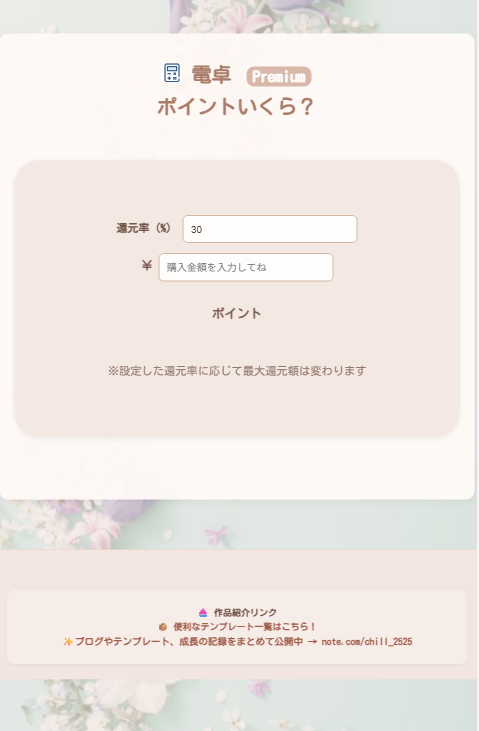

# 🉐 ポイント還元アプリ（無料版）

あなたの「支払い」が、ちょっとだけ楽しくなる。  
このアプリは、支払い金額に応じてポイントを自動で計算する **無料の還元サポートツール** です。

無料でご利用いただける理由は、**広告収益（Google AdSense）による運営**。  
シンプルでやさしいデザインと、安心できる仕様で、どなたでもすぐにご利用いただけます。

---

## 📱 主な特徴

- 💰 支払金額からポイントを自動計算
- 🎨 わかりやすいインターフェースと親しみやすいデザイン
- 📢 Google AdSense広告によって無料提供を実現
- 🧘‍♀️ データは保存されず、アプリを閉じると履歴はすべて消去される安心設計

---

## 🌐 ご利用方法

1. アプリを開きます 👉 [こちらをクリック]([[https://your-app-link.com](https://codeachsh.github.io/HowMuchCalc-Ad-free/)]
2. 支払い金額を入力すると、ポイント還元額がすぐに表示されます
3. 広告が表示されますが、これは無料運営を支える大切な仕組みです🙏

---

## 👀 スクリーンショット

### 🆓 無料版

---

### 🔓 有料版（参考）

- ✅ 広告なしのシンプル画面  
- 🎨 カスタムテーマ機能（優しいピンクベージュ）

---

## 📝 よくある質問（FAQ）

**Q. 本当に無料ですか？広告を見たくないのですが…**  
A. はい、すべての基本機能を無料でお使いいただけます。広告による収益で運営しているため、ご理解いただけると嬉しいです。

**Q. 入力したデータはどこかに保存されますか？**  
A. いいえ、**入力内容や履歴は保存されず**、アプリを閉じると全て消去されます。サーバー送信なども行っていません。

**Q. 有料版との違いは？**  
A. 有料版では広告なし。画面を華やかにデザインしました。

---

## 📩 お問い合わせ・ご意見

アプリに関するお問い合わせやご感想は以下へお送りください：  
📧 contact@example.com  

---

## 📄 ライセンス

MIT License © 2025 [codeAchsh](https://github.com/ycodeAchsh)
